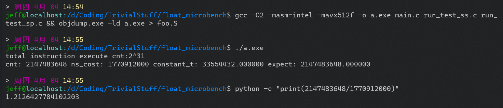
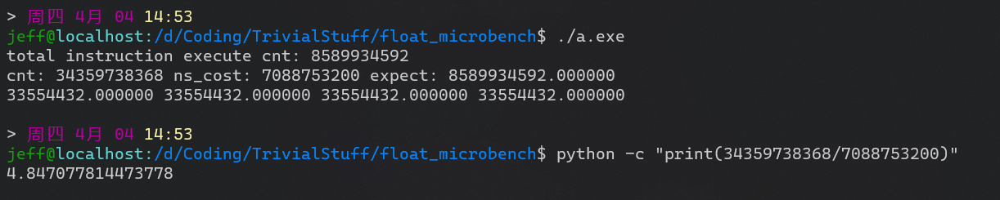

# 浮点数性能运算

参考:
- [compiler explorer](https://godbolt.org/)
- [GCC内联汇编格式](https://blog.csdn.net/weixin_42258222/article/details/116501867)
- [Intel I5-12600KF信息](https://www.intel.com/content/www/us/en/products/sku/134590/intel-core-i512600kf-processor-20m-cache-up-to-4-90-ghz/specifications.html)
- [Intel I5-12600KF指标](https://nanoreview.net/en/cpu/intel-core-i5-12600kf)
- [VFMADD132SS指令家族格式](https://www.felixcloutier.com/x86/vfmadd132ss:vfmadd213ss:vfmadd231ss)

## 构建

```sh
gcc -g -O2 -masm=intel -mavx512f main.c run_test_sp.c run_test_ss.c
# 使用objdump观察生成的汇编，推荐使用godbolt
objdump.exe -ld a.exe > foo.S
```

## 主要方法：

- 使用`VFMADD231SS`汇编指令进行单精度标量的乘加 `t += x * y` 操作
- 使用`VFMADD231PS`汇编指令进行单精度向量的乘加，实现并行计算四个单精度浮点数，参考[VFMADD213PS使用示例与说明](./example_of_vfmadd132ps.md)
- 使用`gcc -masm=intel -mavx512f`参数编译，保证支持相应指令
- 使用内联汇编直接对`xmm1,xmm2,xmm3`寄存器赋值，并内联`vfmadd231ss %%xmm1, %%xmm2, %%xmm3`执行
  - 使用`"+m"`等明确表示寄存器与内存之间的操作数传递
- 使用宏展开在一次循环中增加执行次数，消减循环变量读取的影响
- 使用`register`指示符指定循环变量为寄存器

注: 执行过程可能由于float精读丢失导致最终的值不再变动，但指令应当还是正常执行了的

## 执行结果(i5-12600KF)

- 单精度标量约: 1.212 Gops

  

- 单精度向量约: 4.847 Gops

  
